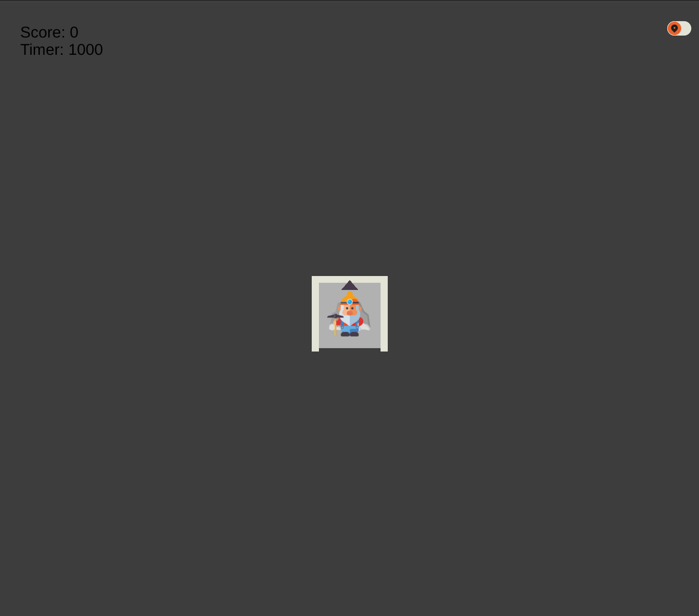

> This code puzzle is a part of Monad’s summer internship application process. By successfully completing the code puzzle with sufficient points and a high-quality implementation, you can secure the opportunity to advance in the application process. The deadline for the code puzzle submission is February 14th, 2024.

---

# Instructions

You can find example implementations in different languages in this repository. 

They are only examples, you can also do your own solution from the ground up!

**NOTE: The scoreboard ranks your code only based on score, but you should still follow software development best practices (e.g. keeping secrets secure, DRY, no unnecessary globals, separation of concerns)**

## Overview



The goal of the game is to solve mazes with the fewest moves possible.

you will only see the walls around you and you have to figure out the maze by moving your way trough it.

You can either move forward, rotate or reset the current run and every level has maximum allowed moves per try.

## Game state

You receive the game state with websockets by subscribing to it.
It contains all the information you should use to solve the level.

The websocket message payload has a `gameState` key, which contains the current state of the game as a stringified JSON. The `gameState` has: Players current rotation and position, number of moves used in current run, number of moves left in a level, start position, target position, the currently visible walls and the size of the maze.

```ts
type Location = {
  x: number
  y: number
}

type Player = {
  position: Location
  rotation: 0 | 45 | 90 | 135 | 180 | 225 | 270 | 315
}

type NoWayOutState = {
  player: Player
  moves: number // moves used in current run
  timer: number // moves left in level
  start: Location
  startRotation: 0 | 45 | 90 | 135 | 180 | 225 | 270 | 315
  target: Location
  square: number // Information of the currently visible walls
  rows: number // Size of the maze
  columns: number // Size of the maze
}
```

## Maze

The maze is a grid of numbers. Each number is from 0 to 15 and represents the walls around the square. 

Each of the 4 bits represents a wall. The bits are in the order of north, east, south and west starting from the most significant bit. If the bit is 1, there is a wall, if it is 0, there is no wall.

For example:
- 0b0000 = 0 -> no walls
- 0b1000 = 1 -> north wall
- 0b0100 = 2 -> east wall
- 0b0010 = 4 -> south wall
- 0b0001 = 8 -> west wall
- 0b1100 = 3 -> north and east walls

Another example:
The maze
```
╶─╮╭┬──╴╭╮
╶╮│├┼┬──╯│
╭╯│├┤│╭─╴│
├╮├┤│├╯╭─╯
││││││╭╯╭╮
│││││╵├─┤│
││╰╯╰╮╵╭┴┤
│├┬─╮│╭╯╷│
││╵╭┼╯╰╮├╯
╵╰─┴┴──╯╰╴
```
Where lines represent routes and no line means a wall, the number squares would be:

```
11 10 12 09 08 10 10 14 09 12
11 12 05 01 00 08 10 10 06 05
09 06 05 01 04 05 09 10 14 05
01 12 01 04 05 01 06 09 10 06
05 05 05 05 05 05 09 06 09 12
05 05 05 05 05 07 01 10 04 05
05 05 03 06 03 12 07 09 02 04
05 01 08 10 12 05 09 06 13 05
05 05 07 09 00 06 03 12 01 06
07 03 10 02 02 10 10 06 03 14
```

## Commands

You send commands with the websocket to update the state.
The message is in format (**requires stringification before sending**):
```json
[
  "run-command", 
  { 
    "gameId": "{game_id}", 
    "payload": <Action>
  }
]
```
Where
```ts
type Action =
  | {
      action: "move" | "reset"
    }
  | {
      action: "rotate"
      rotation: number
    }
```

### Rotate action
The rotation is in degrees and can be any of the following: `0, 45, 90, 135, 180, 225, 270, 315` where 0 is north and 315 is north-west.

You can rotate to any direction, but every action is counted as a move.

### Move action
Moves the player forward one square. If there is a wall in front of the player, the player will not move and the action will be counted as a move. The direction of movement is the current rotation of the player.

If the rotation is diagonal, the player will move diagonally, but the maze has to have a diagonal path in that position. Diagonal move is counted as 1 move.

### Reset action
Resets the current run. The player will be moved to the start position and the moves used in the current run will be reset to 0.

**However, the timer will not be reset.**

Example:
- You have explored the labyrint for 20 moves and you have 10 moves left.
- You send a `reset` action.
- The player will be moved to the start position and the moves used in the current run will be reset to 0.
- You will have 9 moves left. 

You can reset as many times as you want per a level.

## Score

Your score is the number of moves you have used to solve the level.

That means that by sending a `reset` action you also reset your score.

Lowest score wins.

## Levels and Games

The whole system consists of levels and game instances.

Level is a static representation of a initial game state and you can play specific level by creating a game instance from the levels initial game state.

Each game instance is associated with an owner, and only they can make edits. Viewing a game is possible as long as you know the game's entity id.

## Web Socket Message Type Definitions

All the websocket messages are JSON objects in the format of:

```json
["action-name", {...}]
```

Where the payload depends on the action.

List of available WebSockets actions and their respective payloads:

```ts
type Messages = {
  "sub-game": { // Subscribes the WebSocket to the game with the given id
    id: string
  }
  "game-instance": { // Updated game instance. Only sent from the server
    entityId: string
    gameState: string
    ownerId: string
    status: string
    reason: string
    createdAt: Date
    gameType: string
    score: number
    levelId: string
  }
  "run-command": { // Send commands for the game engine. Payload depends on the game type
    gameId: string
    payload: unknown
  }
  "success": { // General purpose success message
    message: string
  }
  "failure":  { // General purpose failure message
    reason: "Forbidden" | "Internal Server Error" | "Bad Request" | "Rate Limit"
    desc?: string
  }
}
```

**ALWAYS REMEMBER TO STRINGIFY THE PAYLOADS BEFORE SENDING THEM!** \
The websocket only accepts string data!


